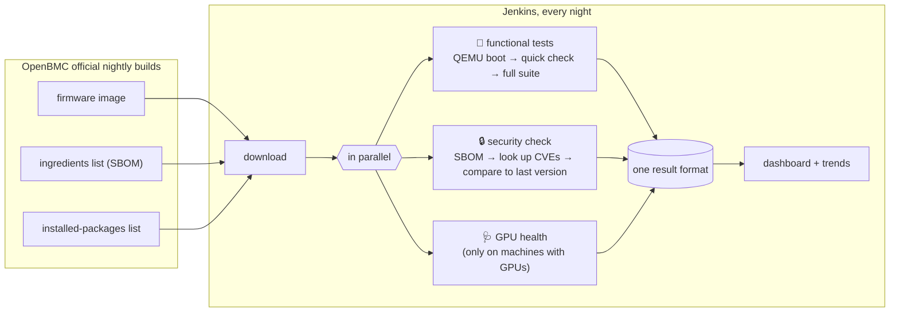

<div align="center">

# bmc-validation-platform

**An automated test lab for server management firmware: does it work, is it secure, is the machine healthy?**

**English** · [繁體中文](README.zh-TW.md) · [Portfolio page](https://flin1206.github.io/bmc-validation-platform/)

[](https://github.com/flin1206/bmc-validation-platform/actions/workflows/ci.yml)
[](https://github.com/flin1206/bmc-validation-platform/actions/workflows/firmware-security.yml)


</div>

---

## The one-minute version

Every datacenter server contains a second, tiny computer called a **BMC** (Baseboard Management Controller). Think of it as a **building's control room**. Even when every light in the building (the server) is off, the control room is awake. From there you can switch the power on and off, read the temperatures, or install a whole new system (update the firmware).

Because the control room has that much power, mistakes in it are expensive:

- **A bug** can turn a server into a brick with one bad update.
- **A security hole** hands an attacker the master key to the building.

Most BMCs run the open-source **OpenBMC** firmware. This project is an **automated production line** that takes the newest OpenBMC firmware every night and runs three kinds of checks on it:

| Check | In plain words | How |
|---|---|---|
| 🔧 **Functional tests** | Do the control room's buttons do the right thing? Does it survive when someone presses them wrong? | Emulate a BMC with QEMU, boot the firmware, and run 65 automated tests against it |
| 🔒 **Security check** | Did this version add security holes the last one didn't have? | List every piece of software inside the firmware (its "ingredients list"), look each one up in vulnerability databases, and **block the release if a serious new one appears** |
| 🩺 **GPU health** | Is the GPU server it manages actually healthy? | Read GPU temperature, memory errors and link speed, then decide: reset it, take it offline, or all good |

All three produce results in one shared format, so Jenkins (the automation server) shows them together in one view with one trend chart.

## Real results

Every number below was **measured, not mocked up**. Reproduce them with `make fetch scan`.

### Finding 1: more than half of the "vulnerabilities" aren't in the firmware

The firmware's **ingredients list** (an SBOM, or Software Bill of Materials) is generated by the build tool Yocto. It lists the software that goes into the firmware, and it also lists **the factory tools used to build it**. Those tools usually have names ending in `-native`.

It's like a cookie package that lists "oven" and "mixer" among its ingredients. Check that list for problems and you find plenty that have nothing to do with the cookie.

| | Findings | of which Critical |
|---|---|---|
| Checked against the raw ingredients list | 301 | 18 |
| Only software **actually installed in the firmware** | **133** | **8** |
| Excluded (factory tools only) | 168 (**56%**) | 10 |

The project filters with the firmware's own "installed packages" list (the manifest), so only software that actually ships is counted. Every excluded item is **still printed in the report**, so a reviewer can check that nothing real was dropped.

### Finding 2: block only what's *new*, or nobody can act on it

Nearly every embedded system has known vulnerabilities. "This version has 133 vulnerabilities" gives nobody anything to do. "This version **added** 3 critical ones" tells you exactly who to ask and what to fix.

So the rule is: **compare against the last version that passed.**

| Comparison | New | Fixed | Result |
|---|---|---|---|
| #1752 → #1754 (normal upgrade) | 0 | 31 (3 critical) | ✅ pass |
| #1754 → #1752 (deliberate downgrade) | 3 critical | 0 | ❌ blocked (exit 1) |

### Also verified

- A firmware image is one 32 MB blob of flash memory. The tool finds the filesystem inside it on its own (at `0x4C0000` in romulus #1754) instead of relying on a hard-coded position.
- Going from ingredients list to vulnerability report takes about **4 seconds** per version.
- The GPU health tool compiles cleanly against NVIDIA's official headers.

## Architecture



## Try it

```bash
make venv                 # install (Python 3.10+)
make unit                 # 32 tests that need no hardware
make fetch                # download the newest official OpenBMC firmware
make scan                 # build the ingredients list and look up vulnerabilities
make boot && make test    # boot the firmware in QEMU and run functional tests (needs qemu-system-arm)
make jenkins-up           # start the whole pipeline at http://localhost:8080
```

Testing a real server? Copy [`hardware-example.yaml`](src/bmcval/data/hardware-example.yaml), fill in its address, and run `pytest tests/functional --profile your-file.yaml`. If the machine lacks a feature, the matching tests are **skipped with a reason**, never counted as passing.

## Glossary

| Term | Plain meaning |
|---|---|
| **BMC** | The small independent management computer inside a server; stays on when the server is off |
| **OpenBMC** | Open-source BMC firmware, used or developed by Meta, Google, NVIDIA and others |
| **Firmware** | Software stored on a chip that makes the hardware work |
| **QEMU** | An emulator: it lets an ordinary PC pretend to be different hardware, so firmware boots without the real board |
| **Redfish / IPMI** | Two "languages" for talking to a BMC remotely. Redfish is a modern web API; IPMI is the older protocol |
| **SBOM** | Software Bill of Materials: which components, at which versions, are inside a piece of software |
| **CVE** | The worldwide ID for a publicly known vulnerability, e.g. `CVE-2026-53791` |
| **Yocto** | The build system OpenBMC uses to produce embedded Linux firmware |
| **Jenkins** | An automation server that runs a sequence of steps on a schedule and keeps the results |
| **JUnit** | A common test-result file format that most tools understand |
| **Xid** | The error code NVIDIA's driver logs when a GPU has a problem |
| **NVML / DCGM** | NVIDIA's GPU monitoring library and its diagnostics tool |

## Repository layout

```
src/bmcval/          core Python code and the bmcval command
tests/unit/          32 tests, no hardware needed
tests/functional/    65 tests that need a BMC
gpu/                 GPU health tool (C++)
security/policy.yaml security rules and the exception list
Jenkinsfile          the nightly pipeline
infra/               Jenkins and test-machine build configs
docs/                detailed docs (English and Chinese)
```

## Read more

| Topic | English | 中文 |
|---|---|---|
| Architecture and why it's designed this way | [architecture](docs/en/architecture.md) | [架構](docs/zh-TW/architecture.md) |
| What is tested and how pass/fail is decided | [test-strategy](docs/en/test-strategy.md) | [測試策略](docs/zh-TW/test-strategy.md) |
| The ingredients list and the security gate in detail | [security](docs/en/security.md) | [韌體資安](docs/zh-TW/security.md) |
| What each Jenkins step does | [ci-pipeline](docs/en/ci-pipeline.md) | [CI 流程](docs/zh-TW/ci-pipeline.md) |
| GPU checks and error classification | [gpu-diagnostics](docs/en/gpu-diagnostics.md) | [GPU 診斷](docs/zh-TW/gpu-diagnostics.md) |

## Status

- [x] Security check run end-to-end on real official firmware (numbers above)
- [x] GPU health tool compiles against NVIDIA's official headers
- [x] All 32 unit tests pass
- [ ] Functional tests run against firmware booted in QEMU
- [ ] GPU checks run on a physical GPU machine

## License

MIT
