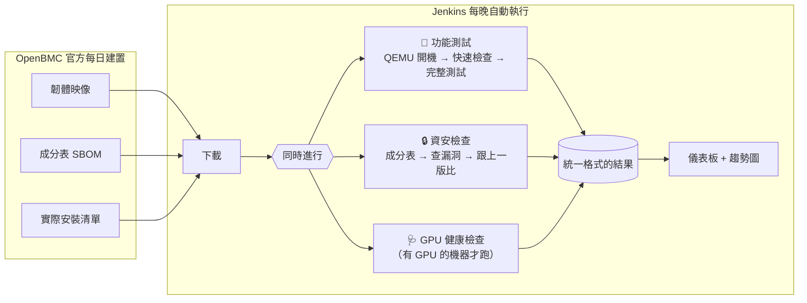

<div align="center">

# bmc-validation-platform

**自動化測試伺服器「管理晶片」韌體的平台：功能對不對、安不安全、機器健不健康，一次檢查完。**

[English](README.md) · **繁體中文** · [作品集頁面](https://flin1206.github.io/bmc-validation-platform/)

[](https://github.com/flin1206/bmc-validation-platform/actions/workflows/ci.yml)
[](https://github.com/flin1206/bmc-validation-platform/actions/workflows/firmware-security.yml)


</div>

---

## 一分鐘看懂

每台資料中心的伺服器裡，都藏著一顆獨立的小電腦，叫做 **BMC**（Baseboard Management Controller）。你可以把它想成**大樓的管理室**：就算整棟樓（伺服器）的燈都關了，管理室還是醒著，可以遠端開關電源、看溫度、甚至幫整棟樓換一套新系統（更新韌體）。

也因為管理室權限這麼大，它出問題的代價很高：

- **有 bug**：可能一次更新就讓伺服器開不了機（俗稱「變磚」）。
- **有漏洞**：駭客等於拿到整棟樓的萬能鑰匙。

大部分 BMC 使用開源的 **OpenBMC** 韌體。這個專案就是一條**自動化生產線**，每天晚上把最新的 OpenBMC 韌體拿來做三種檢查：

| 檢查 | 用白話說 | 怎麼做 |
|---|---|---|
| 🔧 **功能測試** | 管理室的按鈕按下去，會不會做對的事？亂按會不會壞掉？ | 在電腦上用 QEMU 模擬出一顆 BMC，開機後用程式自動跑 65 個測試 |
| 🔒 **資安檢查** | 這一版有沒有比上一版多出新的安全漏洞？ | 列出韌體裡所有軟體的「成分表」，比對漏洞資料庫，**只要新增嚴重漏洞就擋下來** |
| 🩺 **GPU 健康檢查** | 被管理的 GPU 伺服器本身健不健康？ | 讀取 GPU 的溫度、記憶體錯誤、連線速度，判斷要重開、要下線，還是一切正常 |

三種檢查的結果都整理成同一種格式，Jenkins（自動化排程工具）會把它們放在同一個畫面、同一張趨勢圖上。

## 實測結果

以下全部是**真的跑出來的數字**，不是示意。你可以自己執行 `make fetch scan` 重現。

### 發現 1：一半以上的「漏洞」其實不在韌體裡

韌體的**成分表**（SBOM，就像食品包裝上的成分標示）是由建置工具 Yocto 自動產生的。問題是，它除了列出「放進韌體的軟體」，也把**工廠裡用來製造韌體的工具**一起列進去了（名字多半以 `-native` 結尾）。

這就像一包餅乾的成分表上，連「烤箱」和「攪拌機」都寫進去了。拿這份清單去查漏洞，會查到一堆跟餅乾本身無關的問題。

| | 筆數 | 其中「嚴重（Critical）」 |
|---|---|---|
| 直接用原始成分表查漏洞 | 301 | 18 |
| 只保留**真的有放進韌體**的軟體 | **133** | **8** |
| 被排除的（只是工廠工具） | 168（**56%**） | 10 |

這個專案會用韌體附帶的「實際安裝清單」（manifest）過濾，只看真正會出貨的軟體。被排除的項目也會**全部列在報告上**，讓人檢查有沒有排錯。

### 發現 2：只擋「新增」的漏洞，才有辦法執行

幾乎所有嵌入式系統都有已知漏洞。說「這版有 133 個漏洞」，沒有人知道該怎麼做；說「這版**新增了** 3 個嚴重漏洞」，就知道要找誰、改什麼。

所以這裡的把關規則是**跟上一個通過的版本比較**：

| 比較 | 新增 | 修掉 | 結果 |
|---|---|---|---|
| #1752 → #1754（正常升級） | 0 | 31（含 3 個嚴重） | ✅ 通過 |
| #1754 → #1752（故意倒退） | 3 個嚴重 | 0 | ❌ 擋下（exit 1） |

### 其他驗證

- 韌體映像是一整塊 32 MB 的快閃記憶體內容，程式會自己找出裡面的檔案系統位置（romulus #1754 在 `0x4C0000`），不寫死位置。
- 每個版本從成分表到漏洞報告大約 **4 秒**。
- GPU 檢查工具用 NVIDIA 官方的標頭檔編譯，零警告。

## 架構



## 自己跑跑看

```bash
make venv                 # 安裝（需要 Python 3.10 以上）
make unit                 # 跑 32 個不需要任何硬體的測試
make fetch                # 從 OpenBMC 官方下載最新韌體
make scan                 # 產生成分表並查漏洞
make boot && make test    # 用 QEMU 開機韌體並跑功能測試（需要 qemu-system-arm）
make jenkins-up           # 在 http://localhost:8080 啟動整條自動化流程
```

想測真的伺服器？複製 [`hardware-example.yaml`](src/bmcval/data/hardware-example.yaml) 填上 IP，再執行 `pytest tests/functional --profile 你的檔案.yaml`。如果這台機器不支援某個功能，對應的測試會**標註原因並跳過**，不會假裝通過。

## 名詞小抄

| 名詞 | 白話解釋 |
|---|---|
| **BMC** | 伺服器裡獨立的管理小電腦，像大樓管理室，主機關機時也醒著 |
| **OpenBMC** | 開源的 BMC 韌體，Meta、Google、NVIDIA 等公司都在用或參與開發 |
| **韌體（Firmware）** | 燒在晶片裡、讓硬體能運作的軟體 |
| **QEMU** | 模擬器，在一般電腦上假裝成另一種硬體，讓韌體不用真機也能開機 |
| **Redfish / IPMI** | 遠端跟 BMC 溝通的兩種「語言」；Redfish 是新式的網頁 API，IPMI 是老牌協定 |
| **SBOM** | 軟體成分表，列出一份軟體裡包含哪些元件、什麼版本 |
| **CVE** | 公開漏洞的編號，例如 `CVE-2026-53791`，全世界共用 |
| **Yocto** | 用來打造嵌入式 Linux 的建置工具，OpenBMC 用它產生韌體 |
| **Jenkins** | 自動化排程工具，定時執行一連串步驟並保存結果 |
| **JUnit** | 一種測試結果的通用格式，各種工具都看得懂 |
| **Xid** | NVIDIA 驅動回報 GPU 錯誤時用的編號 |
| **NVML / DCGM** | NVIDIA 提供的 GPU 監控介面 / 診斷工具 |

## 專案結構

```
src/bmcval/          核心程式（Python）與 bmcval 指令
tests/unit/          32 個不需硬體的測試
tests/functional/    65 個需要 BMC 的功能測試
gpu/                 GPU 健康檢查工具（C++）
security/policy.yaml 資安把關規則與例外清單
Jenkinsfile          每晚執行的自動化流程
infra/               Jenkins 與測試機的建置設定
docs/                詳細文件（中英文）
```

## 深入閱讀

| 主題 | 中文 | English |
|---|---|---|
| 架構與設計決策：為什麼這樣設計 | [架構](docs/zh-TW/architecture.md) | [architecture](docs/en/architecture.md) |
| 測了哪些東西、怎麼判定對錯 | [測試策略](docs/zh-TW/test-strategy.md) | [test-strategy](docs/en/test-strategy.md) |
| 成分表與漏洞把關的細節 | [韌體資安](docs/zh-TW/security.md) | [security](docs/en/security.md) |
| Jenkins 每一步在做什麼 | [CI 流程](docs/zh-TW/ci-pipeline.md) | [ci-pipeline](docs/en/ci-pipeline.md) |
| GPU 檢查項目與錯誤分類 | [GPU 診斷](docs/zh-TW/gpu-diagnostics.md) | [gpu-diagnostics](docs/en/gpu-diagnostics.md) |

## 目前進度

- [x] 資安檢查已用官方真實韌體完整跑過（數字見上方）
- [x] GPU 檢查工具用 NVIDIA 官方標頭檔編譯通過
- [x] 32 個單元測試全部通過
- [ ] 功能測試在 QEMU 開機的韌體上實際執行
- [ ] 在實體 GPU 機器上執行 GPU 檢查

## 授權

MIT
