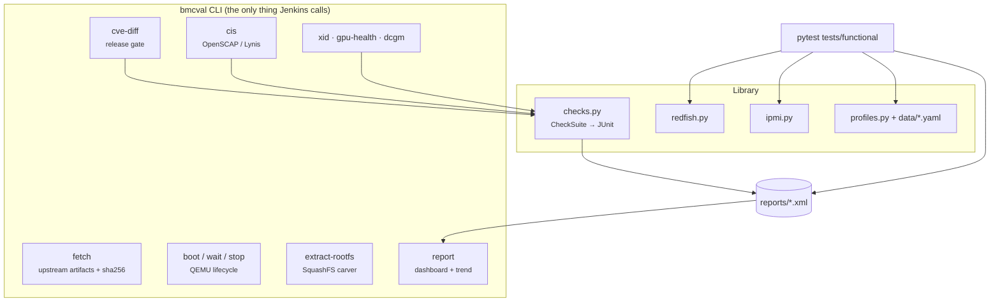

# Architecture & design decisions

**English** · [繁體中文](../zh-TW/architecture.md) · [← README](../../README.md)

## Components



The work is split into a **library**, a **CLI** and a **test suite**. Jenkins calls only the CLI and pytest. Because of that, every stage can be reproduced on a laptop with the exact command the pipeline ran.

## Design decisions

Each decision below records what was chosen, why, and what was rejected.

### D1. QEMU is the default target; hardware is a profile

**Chosen:** boot real upstream OpenBMC images (`romulus`, AST2500) under `qemu-system-arm`.<br>
**Why:** every build is testable with no lab hardware, tests run in parallel, and failures reproduce exactly.<br>
**Rejected:** mocking Redfish responses. A mock verifies the test code, not the firmware.<br>
**Limit, stated honestly:** the emulated BMC has no host CPU behind it, so host power transitions cannot happen. The `qemu-romulus` profile does not declare `host_power`, and those tests are skipped with that reason.

### D2. Every boot starts from a copy of the golden image

The emulated flash is writable. Without a fresh copy, a test that creates a user or flashes firmware would leak state into the next run. That makes failures depend on test order, which is the worst kind of flake. `QemuBmc.start()` copies the pristine image to `flash.mtd` every time.

### D3. Booting is not a pytest fixture

`bmcval boot` runs in its own pipeline step. If boot fails, the build shows **one infrastructure error with the console tail**, not 65 red tests. It also lets several pytest invocations share one boot.

### D4. Readiness means "usable", not "listening"

bmcweb answers `GET /redfish/v1` well before the D-Bus services behind it are up. Readiness therefore means *a session can be created* **and** *the Managers collection is populated*. Checking only the service root gives false greens and then a burst of flaky failures.

### D5. Capabilities, not `if platform == ...`

Profiles declare what a platform supports (`host_power`, `sensors`, `firmware_update_push`…). A test declares what it needs with `@pytest.mark.requires(...)`. When a capability is missing, the test is **skipped with the reason**, so the report never shows a pass for something that was not tested. An unknown key in a profile (for example a misspelled `capabilites`) is a hard error, because a silent typo would silently skip tests.

### D6. The Redfish client never raises on HTTP status

Negative tests need to look at 4xx bodies, so the client returns every response and each test asserts explicitly. It retries on **connection** failures only (BMC rebooting, slirp hiccups), never on HTTP errors, so retries cannot hide a flaky endpoint.

### D7. One result model for everything that isn't pytest

The CVE gate, CIS audit, Lynis, DCGM, NVML and Xid triage all emit a `CheckSuite` (pass / warn / fail / skip / error) that serialises to JUnit and JSON. Jenkins' test view, trend graph and the HTML dashboard therefore need zero per-tool code. JUnit has no "warning", so warnings are written to `system-out`: visible, but not failing.

### D8. Gate the security *delta*, not the absolute count

"This image has 133 known CVEs" is true of almost every embedded Linux image, and nobody can act on it. "This build introduced 3 new Criticals" is actionable. See [security.md](security.md).

### D9. Port forwards bind to 127.0.0.1

The emulated BMC ships the well-known default password `0penBmc`. The QEMU `hostfwd` rules bind to loopback only, so a CI agent never exposes a default-credential BMC on the lab network. A unit test checks this, so it cannot quietly regress.

### D10. Upstream artifacts are resolved through the Jenkins API

Upstream publishes only the `.static.mtd` under a stable name. The SBOM, manifest and update tarball are timestamped, and their stable names are symlinks that Jenkins will not serve. `bmcval fetch` resolves the real names through the Jenkins JSON API and records a sha256 for every file, so a report can always be traced back to exact bytes.

## Directory layout

```
src/bmcval/            library + CLI
  data/*.yaml          platform profiles
  security/            squashfs carver, CVE gate, CIS/Lynis parsers
  gpu/                 Xid triage, DCGM / NVML result parsers
tests/unit/            hardware-free, run on every push
tests/functional/      live BMC (QEMU or hardware)
gpu/                   C++17 NVML health tool (CMake)
scripts/               firmware-scan.sh
security/policy.yaml   CVE gate policy and waivers
infra/jenkins/         controller image + JCasC
infra/packer/          hardened agent image + CIS audit
Jenkinsfile            nightly pipeline
```
