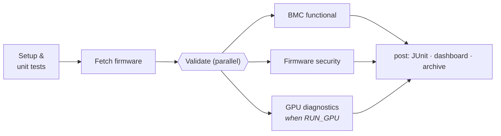

# CI pipeline

**English** · [繁體中文](../zh-TW/ci-pipeline.md) · [← README](../../README.md)

Two CI systems, each with a clear job:

| | Jenkins ([`Jenkinsfile`](../../Jenkinsfile)) | GitHub Actions ([`.github/workflows`](../../.github/workflows)) |
|---|---|---|
| Purpose | The lab pipeline: boot firmware, run everything, keep history | Keep the repo healthy in public |
| Runs | nightly (`H 2 * * *`) and on demand | every push/PR; security scan nightly |
| Needs | QEMU agent, optional GPU agent | nothing |

## Jenkins stages



| Stage | Details |
|---|---|
| **Setup & unit tests** | venv, `ruff`, unit tests. A broken toolkit fails here in seconds, before any image is downloaded |
| **Fetch firmware** | `bmcval fetch` with the `CANDIDATE_BUILD` param. The build description is set to `romulus#<n>` so the history is readable at a glance |
| **BMC functional** | `bmcval boot` → **smoke gate** → full suite. Functional failures mark the build *unstable* (it ran, the firmware has bugs); boot or smoke failures mark it *failed* (the run is invalid). `post { always }` stops QEMU and archives `console.log` and boot timing |
| **Firmware security** | `firmware-scan.sh` → baseline from `copyArtifacts(lastSuccessful())` → `cve-diff`. Exit 1 means **policy failure**, exit 2 means **infrastructure failure**. They are reported differently, because "the scanner broke" must never read as "the firmware is fine" |
| **GPU diagnostics** | `agent { label 'gpu' }` with `beforeAgent true`, so no GPU executor is held when the stage is off. Results are stashed back to the main agent for the dashboard |
| **post** | `junit 'reports/**/*.xml'` → `bmcval report` (dashboard + per-suite trend kept in `$JENKINS_HOME`) → `publishHTML` → archive |

### Choices worth noting

- **`disableConcurrentBuilds()`**: one QEMU instance owns the forwarded ports. Scaling out means more agents, not more executors per agent.
- **Status semantics:** *failed* means we could not trust the run, *unstable* means the firmware has bugs, and *success* means all gates are green. Keeping these apart keeps the nightly signal readable.
- **Everything is a CLI call.** Any stage can be reproduced locally with the same command; there is no logic that only exists in Groovy.

## Running the lab

```bash
make jenkins-up     # builds controller image (QEMU, syft, grype, plugins) and applies JCasC
open http://localhost:8080   # admin / $JENKINS_ADMIN_PASSWORD (default: admin)
```

The controller is defined entirely by [`casc.yaml`](../../infra/jenkins/casc.yaml): security realm, labels (`qemu security`) and the `firmware-validation` job created by Job DSL. The whole lab can be destroyed and rebuilt from git.

For a multi-node lab, build agents with [Packer](../../infra/packer) and attach them with labels `qemu`, `security` and `gpu`.

## GitHub Actions

- **ci.yml**: ruff, unit tests, functional-suite collection (catches import errors in tests that need hardware), shellcheck, and a **GPU tool build inside `nvidia/cuda:*-devel`**, linking against the NVML stub so no GPU is needed.
- **firmware-security.yml**: nightly scan of the two newest upstream builds, run in public. The CVE delta is written to the job summary and the SBOMs are uploaded as artifacts.
