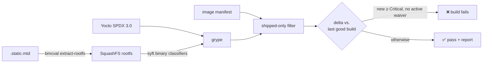

# Firmware supply-chain security

**English** · [繁體中文](../zh-TW/security.md) · [← README](../../README.md)

The security stage protects two things: **the firmware under test** (SBOM, CVE delta gate) and **the machines doing the testing** (hardened agent image with a CIS audit).

## 1. Firmware: from flash image to release decision



### Getting at the rootfs

An OpenBMC `static.mtd` is a raw 32 MiB flash image: U-Boot, kernel FIT, read-only SquashFS rootfs and a writable overlay, one after another. Offsets differ between machines, so `bmcval extract-rootfs` does not hard-code a layout. It scans for the SquashFS magic `hsqs` and **validates the superblock** (version 4, block size is a power of two and agrees with `block_log`, known compressor, `bytes_used` inside the file) before trusting it. Kernel images often contain the bytes `hsqs` by chance; without that validation you carve garbage.

On romulus build #1754 it finds the rootfs at offset `0x4C0000`: 23,222,854 bytes, xz, 128 KiB blocks. `/etc/os-release` inside it identifies OpenBMC `3.1.0-dev-1341-g16d23c4743`.

### Which SBOM to trust

| Source | What it knows | Problem |
|---|---|---|
| Syft over the rootfs | Only binary signatures | OpenBMC ships **no package database** (`/var/lib/opkg` does not exist), so most packages are invisible |
| Yocto image SPDX | Every recipe, version and CPE | Also describes **build-host tools** that never ship |
| Yocto SPDX **filtered by the image manifest** | Exactly what is installed | none: this is what the gate uses |

The pipeline scans the Yocto SPDX. It also keeps a Syft rootfs SBOM, because its binary classifiers catch statically linked components that no recipe declares.

### The measurement that shaped the design

Real numbers from upstream romulus #1754:

| | Matches | Critical |
|---|---|---|
| Grype on raw Yocto SPDX | 301 | 18 |
| After the shipped-only filter | **133** | **8** |
| Excluded | 168 (56%) | 10 |

The largest excluded groups are `rsync-native` (29), `python3`/`python3-native` (15 each), `unzip-native` (14), `libxml2`/`libxml2-native` (11 each) and `openssl-native` (10). None of them are in the image: `/usr/bin/python*` and `libxml2*` do not exist in the rootfs, and none appear in the manifest.

Excluded packages are **listed in the report, not hidden**, so a reviewer can check that the filter did not drop something real.

### The gate

`bmcval cve-diff` groups findings by `(CVE, package)` and puts each one in a bucket:

- **new**: in the candidate but not the baseline. These are gated.
- **fixed**: in the baseline but gone from the candidate. Reported as a win.
- **carried**: in both. Tracked, and gated only if `gate_carried: true`.

The version is left out of the key on purpose. A package bump from 3.0.1 to 3.0.2 that does not fix CVE-X should show as *carried*, not as "fixed + new".

**Baseline:** in Jenkins, the baseline is the `grype.json` archived by the **last successful run of this job**, which makes the gate a regression detector. You can also pin a specific upstream build.

**Proof on real data** (#1752 → #1754): 31 fixed (3 Critical, 18 High, 29 of them from `rsync` leaving the image), 0 new → **PASS**. Swap the builds and the same 3 Criticals become new → **FAIL, exit 1**.

### Waivers expire

```yaml
waivers:
  - id: CVE-2019-1010022
    package: libc6
    reason: "disputed upstream; requires a pre-existing memory corruption bug"
    owner: flin1206
    expires: 2026-12-31
```

`id`, `reason`, `owner` and `expires` are all required. When a waiver expires it **stops suppressing** its finding and appears as a warning. Accepted risk then comes back for review automatically, instead of staying in a YAML file forever.

## 2. BaseOS: the agents are under test too

A test result is only as trustworthy as the machine that produced it. [`infra/packer/`](../../infra/packer) builds the Jenkins agent image:

1. Ubuntu 24.04 cloud image, plus agent tools (QEMU, ipmitool, syft, grype, OpenSCAP, Lynis).
2. [`20-harden.sh`](../../infra/packer/scripts/20-harden.sh): CIS Level 1-oriented controls (unused filesystems disabled, network sysctls, ufw default-deny, auditd identity/sudo rules, SSH root and password login off, pwquality, AIDE baseline). Each block is labelled with the CIS section it addresses.
3. [`90-audit.sh`](../../infra/packer/scripts/90-audit.sh): OpenSCAP `cis_level1_server` and Lynis. **The image build fails** if the Lynis hardening index is below `min_hardening_index`.
4. The audit evidence is downloaded before the image is sealed, and `bmcval cis` converts it to JUnit. High and medium severity rule failures fail the build; low severity ones only warn, so a new upstream low-severity rule does not break CI overnight.
5. The build account is deleted and machine-id is cleared, so clones do not share an identity.
