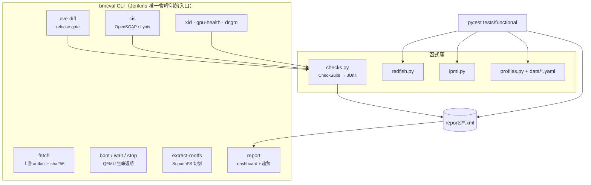

# 架構與設計決策

[English](../en/architecture.md) · **繁體中文** · [← README](../../README.zh-TW.md)

## 元件



整個專案分成**函式庫**、**CLI** 和**測試集**三層，Jenkins 只會呼叫 CLI 和 pytest。因此每個 stage 都能在筆電上用 pipeline 跑的同一行指令重現。

## 設計決策

每一項都記錄了選擇什麼、為什麼，以及放棄了什麼。

### D1. 預設目標是 QEMU；實體硬體用 profile 接入

**選擇：** 用 `qemu-system-arm` 開機上游的真實 OpenBMC 映像（`romulus`，AST2500）。<br>
**原因：** 不需要實驗室硬體就能測每一個 build，測試可以平行執行，失敗也能精確重現。<br>
**放棄：** 模擬 Redfish 回應。mock 驗證的是測試程式本身，不是韌體。<br>
**誠實說明限制：** 模擬出來的 BMC 背後沒有主機 CPU，所以不會有真的主機電源狀態切換。`qemu-romulus` profile 沒有宣告 `host_power`，相關測試會標示這個原因並跳過。

### D2. 每次開機都從 golden image 的複本開始

模擬的 flash 是可寫的。如果不重新複製，建立帳號或刷韌體的測試就會把狀態留給下一輪，失敗結果會取決於測試順序，這是最難抓的一種不穩定。`QemuBmc.start()` 每次都會把原始映像複製成 `flash.mtd`。

### D3. 開機不是 pytest fixture

`bmcval boot` 是 pipeline 裡獨立的一步。開機失敗時，build 會顯示**一個附上 console 尾段的基礎設施錯誤**，而不是 65 個紅燈。這樣也能讓多個 pytest 共用同一次開機。

### D4. 「就緒」指的是「可以用」，不是「有在聽」

bmcweb 在後面的 D-Bus 服務啟動完成之前，就已經會回應 `GET /redfish/v1`。所以就緒的定義是：*可以建立 session*，**而且** *Managers collection 已經有成員*。只檢查 service root 會先得到假的綠燈，接著出現一連串不穩定的失敗。

### D5. 用能力宣告，而不是 `if platform == ...`

Profile 宣告平台支援哪些功能（`host_power`、`sensors`、`firmware_update_push`…），測試則用 `@pytest.mark.requires(...)` 宣告自己需要什麼。缺少某項能力時，測試會**標示原因並跳過**，報告裡絕不會出現「沒測卻算通過」。Profile 出現未知的 key（例如打錯字的 `capabilites`）會直接報錯，因為一個沒被發現的拼字錯誤，會讓測試在沒人注意的情況下被跳過。

### D6. Redfish client 不會因為 HTTP 狀態碼丟例外

負向測試需要檢查 4xx 的回應內容，所以 client 會回傳所有 response，由每個測試自己明確 assert。重試只針對**連線**失敗（BMC 重開、slirp 不穩），HTTP 錯誤不重試，以免重試把不穩定的 endpoint 蓋掉。

### D7. pytest 以外的工具都用同一個結果模型

CVE gate、CIS 稽核、Lynis、DCGM、NVML、Xid 分診都輸出 `CheckSuite`（pass / warn / fail / skip / error），可以序列化成 JUnit 和 JSON。所以 Jenkins 的測試畫面、趨勢圖和 HTML dashboard 都不需要針對個別工具寫程式。JUnit 沒有「warning」這個狀態，所以警告寫進 `system-out`：看得到，但不會讓 build 失敗。

### D8. 資安 gate 看的是「差異」，不是總數

「這個映像有 133 個已知 CVE」幾乎對所有嵌入式 Linux 映像都成立，沒人能據此採取行動。「這次 build 新增了 3 個 Critical」才有辦法處理。詳見 [security.md](security.md)。

### D9. Port forwarding 只綁 127.0.0.1

模擬的 BMC 使用眾所周知的預設密碼 `0penBmc`。QEMU 的 `hostfwd` 規則只綁 loopback，所以 CI agent 絕不會把使用預設密碼的 BMC 暴露在實驗室網路上。這點有單元測試守著，不會在沒人注意的情況下退步。

### D10. 透過 Jenkins API 解析上游 artifact

上游只有 `.static.mtd` 用固定檔名發布。SBOM、manifest 和更新包都帶時間戳記，它們的固定檔名是 Jenkins 不提供下載的 symlink。`bmcval fetch` 透過 Jenkins JSON API 解析出真實檔名，並記錄每個檔案的 sha256，所以任何一份報告都能追溯到確切的位元組。

## 目錄結構

```
src/bmcval/            函式庫 + CLI
  data/*.yaml          平台 profile
  security/            squashfs 切割、CVE gate、CIS/Lynis 解析
  gpu/                 Xid 分診、DCGM / NVML 結果解析
tests/unit/            不需硬體，每次 push 都跑
tests/functional/      真實 BMC（QEMU 或實體機）
gpu/                   C++17 NVML 健康檢查工具（CMake）
scripts/               firmware-scan.sh
security/policy.yaml   CVE gate 政策與豁免
infra/jenkins/         controller 映像 + JCasC
infra/packer/          hardened agent 映像 + CIS 稽核
Jenkinsfile            每晚執行的 pipeline
```
