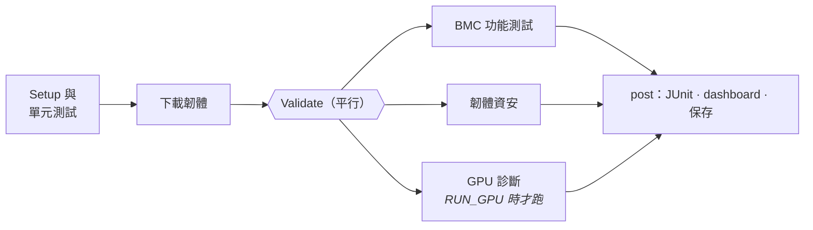

# CI 流程

[English](../en/ci-pipeline.md) · **繁體中文** · [← README](../../README.zh-TW.md)

兩套 CI，各自分工明確：

| | Jenkins（[`Jenkinsfile`](../../Jenkinsfile)） | GitHub Actions（[`.github/workflows`](../../.github/workflows)） |
|---|---|---|
| 用途 | 實驗室 pipeline：開機韌體、跑完所有測試、保存歷史 | 在公開環境維持 repo 的健康 |
| 執行時機 | 每晚（`H 2 * * *`）或手動觸發 | 每次 push/PR；資安掃描每晚一次 |
| 需要 | QEMU agent，GPU agent 可選 | 什麼都不需要 |

## Jenkins stage



| Stage | 細節 |
|---|---|
| **Setup 與單元測試** | 建 venv、跑 `ruff` 和單元測試。工具本身壞掉的話幾秒內就會在這裡失敗，不會浪費時間去下載映像 |
| **下載韌體** | 依 `CANDIDATE_BUILD` 參數執行 `bmcval fetch`。Build 描述會設成 `romulus#<n>`，看歷史紀錄一眼就知道測的是哪個版本 |
| **BMC 功能測試** | `bmcval boot` → **smoke gate** → 完整測試集。功能測試失敗會標為 *unstable*（有跑完，是韌體有 bug）；開機或 smoke 失敗則標為 *failed*（這次執行結果無效）。`post { always }` 會關掉 QEMU，並保存 `console.log` 和開機耗時 |
| **韌體資安** | `firmware-scan.sh` → 用 `copyArtifacts(lastSuccessful())` 取得 baseline → `cve-diff`。Exit 1 代表**政策不通過**，exit 2 代表**基礎設施故障**。兩者分開回報，因為「掃描工具壞了」絕對不能被解讀成「韌體沒問題」 |
| **GPU 診斷** | `agent { label 'gpu' }` 搭配 `beforeAgent true`，stage 關閉時就不會佔用 GPU executor。結果會 stash 回主要 agent 給 dashboard 使用 |
| **post** | `junit 'reports/**/*.xml'` → `bmcval report`（dashboard，加上存在 `$JENKINS_HOME` 的各測試集趨勢）→ `publishHTML` → 保存 artifact |

### 值得一提的選擇

- **`disableConcurrentBuilds()`**：同一時間只有一個 QEMU 佔用轉發的 port。要擴充就增加 agent，而不是增加每個 agent 的 executor。
- **狀態語意：** *failed* 代表這次執行結果不可信，*unstable* 代表韌體有 bug，*success* 代表所有 gate 都是綠燈。把這三種分清楚，每晚的結果才看得懂。
- **全部都是 CLI 呼叫。** 任何一個 stage 都能在本機用同一行指令重現，沒有只存在於 Groovy 裡的邏輯。

## 啟動實驗室

```bash
make jenkins-up     # 建 controller 映像（QEMU、syft、grype、plugins）並套用 JCasC
open http://localhost:8080   # admin / $JENKINS_ADMIN_PASSWORD（預設：admin）
```

Controller 完全由 [`casc.yaml`](../../infra/jenkins/casc.yaml) 定義：安全設定、label（`qemu security`），以及由 Job DSL 建立的 `firmware-validation` job。整個實驗室都能刪掉，再從 git 重建。

多節點的實驗室可以用 [Packer](../../infra/packer) 建 agent，再以 `qemu`、`security`、`gpu` 等 label 接上。

## GitHub Actions

- **ci.yml**：ruff、單元測試、功能測試集的收集檢查（抓出需要硬體的測試裡的 import 錯誤）、shellcheck，以及**在 `nvidia/cuda:*-devel` 裡編譯 GPU 工具**，連結 NVML stub，不需要 GPU。
- **firmware-security.yml**：每晚掃描上游最新的兩個 build，全部公開執行。CVE 差異會寫進 job summary，SBOM 則上傳成 artifact。
