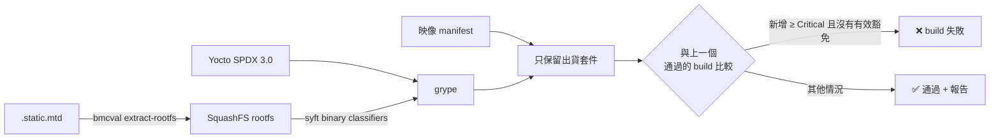

# 韌體供應鏈資安

[English](../en/security.md) · **繁體中文** · [← README](../../README.zh-TW.md)

資安 stage 保護兩個對象：**待測韌體**（SBOM、CVE 差異 gate），以及**負責測試的機器**（有 CIS 稽核的 hardened agent 映像）。

## 1. 韌體：從快閃映像到出貨判斷



### 取出 rootfs

OpenBMC 的 `static.mtd` 是一份 32 MiB 的原始快閃映像，依序放著 U-Boot、kernel FIT、唯讀的 SquashFS rootfs 和可寫的 overlay。不同機型的 offset 不一樣，所以 `bmcval extract-rootfs` 不寫死 layout，而是搜尋 SquashFS 的 magic `hsqs`，並且在採信之前**驗證 superblock**：版本是 4、block size 是 2 的冪次且和 `block_log` 一致、壓縮格式已知、`bytes_used` 沒有超出檔案。Kernel 映像裡常常剛好出現 `hsqs` 這幾個位元組，不驗證就會切出一堆垃圾。

在 romulus build #1754 上，它在 offset `0x4C0000` 找到 rootfs：23,222,854 bytes、xz、128 KiB block。裡面的 `/etc/os-release` 顯示版本是 OpenBMC `3.1.0-dev-1341-g16d23c4743`。

### 該相信哪一份 SBOM

| 來源 | 知道什麼 | 問題 |
|---|---|---|
| 對 rootfs 跑 Syft | 只有二進位特徵 | OpenBMC **沒有附套件資料庫**（`/var/lib/opkg` 不存在），大部分套件都看不到 |
| Yocto 映像 SPDX | 每個 recipe、版本、CPE | 也把**建置主機的工具**寫進去了，但那些工具根本不會出貨 |
| **用映像 manifest 過濾過的** Yocto SPDX | 確切裝了什麼 | 沒有問題，gate 用的就是這份 |

Pipeline 掃描的是 Yocto SPDX。另外也保留一份 Syft 對 rootfs 產的 SBOM，因為它的 binary classifier 能抓到沒有任何 recipe 宣告的靜態連結元件。

### 影響設計的那組數據

上游 romulus #1754 的真實數字：

| | 筆數 | Critical |
|---|---|---|
| Grype 直接掃 Yocto SPDX | 301 | 18 |
| 只保留出貨套件之後 | **133** | **8** |
| 被排除的 | 168（56%） | 10 |

被排除最多的是 `rsync-native`（29）、`python3`/`python3-native`（各 15）、`unzip-native`（14）、`libxml2`/`libxml2-native`（各 11）和 `openssl-native`（10）。這些都不在映像裡：rootfs 裡沒有 `/usr/bin/python*`，也沒有 `libxml2*`，manifest 裡也都找不到。

被排除的套件會**列在報告裡，而不是藏起來**，讓審查者確認過濾沒有把真的漏洞刪掉。

### Gate 的判斷方式

`bmcval cve-diff` 以 `(CVE, 套件)` 為單位，把每一筆發現分到三類：

- **新增**：candidate 有、baseline 沒有。這類會被 gate 把關。
- **已修復**：baseline 有、candidate 沒有了。當成成果回報。
- **延續**：兩邊都有。持續追蹤，只有設定 `gate_carried: true` 時才會把關。

Key 裡刻意不放版本號。套件從 3.0.1 升到 3.0.2 但沒修掉 CVE-X，應該算*延續*，而不是「修掉一個 + 新增一個」。

**Baseline：** 在 Jenkins 裡，baseline 是**這個 job 上一次成功執行**時保存的 `grype.json`，所以這個 gate 本質上是退步偵測器。也可以指定某個上游 build 當 baseline。

**真實資料上的驗證**（#1752 → #1754）：修掉 31 筆（Critical 3、High 18，其中 29 筆來自 `rsync` 被移出映像），新增 0 筆 → **通過**。把兩個 build 對調，同樣那 3 筆 Critical 就變成新增 → **失敗，exit 1**。

### 豁免會過期

```yaml
waivers:
  - id: CVE-2019-1010022
    package: libc6
    reason: "上游有爭議；需要先有記憶體損毀漏洞才能利用"
    owner: flin1206
    expires: 2026-12-31
```

`id`、`reason`、`owner`、`expires` 都是必填。豁免過期後就**不再壓制**那筆發現，而是改以警告出現。接受過的風險會因此自動回到審查流程，不會永遠留在某個 YAML 檔裡。

## 2. BaseOS：agent 本身也要受測

測試結果的可信度，取決於產生它的機器。[`infra/packer/`](../../infra/packer) 負責建 Jenkins agent 映像：

1. Ubuntu 24.04 cloud image，加上 agent 工具（QEMU、ipmitool、syft、grype、OpenSCAP、Lynis）。
2. [`20-harden.sh`](../../infra/packer/scripts/20-harden.sh)：以 CIS Level 1 為目標的設定（停用不需要的檔案系統、網路 sysctl、ufw 預設拒絕、auditd 的身分與 sudo 規則、關閉 SSH root 與密碼登入、pwquality、AIDE 基準）。每個區塊都標注對應的 CIS 章節。
3. [`90-audit.sh`](../../infra/packer/scripts/90-audit.sh)：OpenSCAP `cis_level1_server` 與 Lynis。Lynis hardening index 低於 `min_hardening_index` 時，**映像建置就會失敗**。
4. 稽核證據會在映像封裝前下載下來，再由 `bmcval cis` 轉成 JUnit。High 和 medium 等級的規則失敗會讓 build 失敗；low 等級只發出警告，以免上游新增一條低嚴重度規則就讓 CI 隔天全紅。
5. 建置用的帳號會被刪除、machine-id 會被清空，避免複製出來的機器共用同一個身分。
